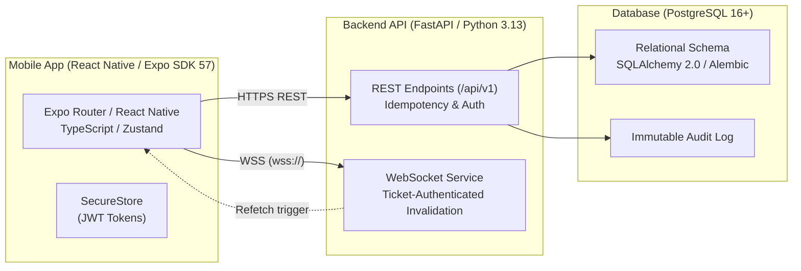

# Friend Ledger

[](https://github.com/Er-Arif/friend-ledger/actions/workflows/ci.yml)


Friend Ledger is a mobile-first shared expense ledger for friends. It helps friend groups track who paid, who owes whom, and record settlements across outings while preserving direct, transparent pairwise debt relationships.

---

## Current Status

* **Release Candidate**: `v1.0.0-rc.1`
* **Stage**: Release Candidate & Production Preparation
* **Feature Freeze**: All v1 application features and API contracts are frozen. Maintenance is strictly limited to production hardening, deployment automation, and release documentation.

---

## Core Features

* **Account Management**: Username and password registration with secure Argon2id hashing and token-based sessions.
* **Outings & Shared Sessions**: Create outings and invite participants instantly via 6-character join codes or camera QR scanning.
* **Shared Payments**: Record payments with equal splitting or custom exact amounts, calculated down to the integer paisa (no floating-point rounding errors).
* **Strict Pairwise Balances**: Computes direct 1:1 net balances between friends without transitive debt simplification.
* **Settlement Records**: Record partial or full repayments directly against pairwise balances.
* **Void-Based Financial Corrections**: Maintains immutable audit integrity by voiding mistaken payments or settlements rather than destructively deleting them.
* **UPI-Assisted Settlements**: Creditors can display dynamic UPI payment QR codes (`upi://pay`), and debtors can launch their installed UPI apps (Google Pay, PhonePe, Paytm) with payee and amount pre-filled.
* **Explicit Settlement Confirmation**: Complies with the principle that Friend Ledger is not a gateway—returning from external UPI apps requires explicit user confirmation before recording settlements.
* **Realtime Synchronization**: Low-latency WebSocket invalidation signals prompt active mobile clients to immediately refetch authoritative server state.
* **Idempotent Mutations**: Financial write operations require client-generated UUID idempotency keys to safeguard against network retries and duplicate charges.
* **Audit Trail**: Every significant financial and session mutation is logged to an immutable audit table.
* **PostgreSQL Persistence**: Fully ACID-compliant relational storage backed by SQLAlchemy 2.0 and versioned Alembic migrations.

---

## Important Product Principles

Friend Ledger operates under strict domain guardrails:

1. **Does Not Move Money**: Friend Ledger is not a bank, digital wallet, or payment gateway. It holds zero user funds.
2. **External Payments**: Financial transfers occur directly between users (via cash or external UPI banking apps). Friend Ledger records settlements only after the payer explicitly confirms completion.
3. **No Financial Credentials**: The application never collects, processes, or stores bank account numbers, debit/credit cards, or UPI PINs.
4. **Strict Pairwise Debt Relationships**: Debts are never transitively simplified or pooled across groups.
   > **Example**: If Alice owes Bob ₹500, and Bob owes Charlie ₹500, Friend Ledger preserves Alice's debt to Bob and Bob's debt to Charlie. It will never rewrite the ledger to make Alice owe Charlie.

---

## Architecture Overview



* **Mobile Client**: React Native, Expo SDK 57, Expo Router (file-based routing), TypeScript, Zustand for global state, and Expo SecureStore for encrypted auth token storage.
* **Backend API**: FastAPI on Python 3.13, Uvicorn ASGI server, Pydantic v2 validation.
* **Database**: PostgreSQL with SQLAlchemy 2.0 ORM, Psycopg 3 driver with `pool_pre_ping=True`, and linear Alembic migrations.
* **Realtime Invalidation**: Ticket-authenticated WebSockets (`POST /api/v1/realtime/ticket` -> `GET /api/v1/realtime/ws?ticket=...`). Transmits event notifications only; clients refetch authoritative data over REST.
* **Authentication**: Password hashing with Argon2id, short-lived JWT access tokens (15 mins), and single-use rotating refresh tokens (30 days).

For detailed technical designs, refer to the [Documentation](#documentation) directory.

---

## Project Structure

```text
friend-ledger/
├── .github/
│   └── workflows/ci.yml       # GitHub Actions CI workflow (Backend & Mobile)
├── backend/
│   ├── alembic/               # Alembic database migrations and configuration
│   ├── app/                   # FastAPI application (api, core, db, models, schemas, services)
│   ├── tests/                 # Backend pytest test suite (111 tests)
│   ├── Dockerfile             # Production Dockerfile
│   ├── railway.json           # Railway production deployment configuration
│   └── pyproject.toml         # Python project manifest and dependencies (uv)
├── mobile/
│   ├── src/                   # React Native source (app router, components, lib, stores, utils)
│   ├── tests/                 # Mobile unit test suite (24 tests)
│   ├── app.json               # Expo application configuration & iOS/Android metadata
│   ├── eas.json               # EAS build configuration for Android APK / production
│   └── package.json           # Mobile npm package manifest and dependencies
├── docs/                      # Authoritative architecture and release specifications
└── README.md                  # Project overview and developer guide
```

---

## Local Development

### Prerequisites

* [uv](https://docs.astral.sh/uv/) (Python package manager)
* Python 3.13+
* Node.js 22+ & npm
* PostgreSQL 16+ running locally

### 1. Backend Setup

```bash
# Navigate to backend directory
cd backend

# Create .env from template
cp .env.example .env
# Configure DATABASE_URL, TEST_DATABASE_URL, and JWT_SECRET in .env

# Install dependencies and sync virtual environment
uv sync --dev

# Run database migrations
uv run alembic upgrade head

# Start local development server
uv run uvicorn app.main:app --reload --host 0.0.0.0 --port 8000
```

Verify backend health at: [http://localhost:8000/health/ready](http://localhost:8000/health/ready)

### 2. Mobile Setup

```bash
# Navigate to mobile directory
cd mobile

# Create .env from template
cp .env.example .env

# Install dependencies
npm install

# Start Expo development server
npx expo start
```

#### Physical Device Testing
To test on a physical iOS or Android device via Expo Go or a development build, set your computer's local LAN IP in `mobile/.env`:
```text
EXPO_PUBLIC_API_BASE_URL=http://192.168.x.x:8000
```
*(Example local development IP; replace `192.168.x.x` with your machine's actual LAN IP).*

---

## Environment Files

* Backend template: [`backend/.env.example`](backend/.env.example)
* Mobile template: [`mobile/.env.example`](mobile/.env.example)

> [!IMPORTANT]
> Real `.env` files contain local secrets and are strictly ignored by Git (`.gitignore`). Never commit real secrets or credentials to the repository.

---

## Automated Testing & Quality Gates

### Backend Validation
```bash
cd backend

# Run Ruff linter and formatter checks
uv run ruff check .

# Run Alembic schema drift verification
uv run alembic check

# Run full test suite (111 tests)
uv run pytest -vv
```

### Mobile Validation
```bash
cd mobile

# Run unit tests (24 tests)
npm test

# Run ESLint check
npm run lint

# Run TypeScript type check
npx tsc --noEmit

# Run Expo diagnostics (21 checks)
npx expo-doctor
```

---

## Continuous Integration

GitHub Actions automatically runs full quality gates on every `push` and `pull_request` to `main`:

* **Backend Job**: Spins up a PostgreSQL 17 service container, installs dependencies with `uv`, validates migrations with Alembic, checks formatting with Ruff, and runs all 111 pytest tests.
* **Mobile Job**: Sets up Node.js 22, installs dependencies via `npm ci`, runs 24 unit tests, verifies TypeScript types (`tsc --noEmit`), checks ESLint, and executes `expo-doctor`.

See workflow definition at [`.github/workflows/ci.yml`](.github/workflows/ci.yml).

---

## Documentation

Comprehensive design specifications and operational guides are maintained in [`docs/`](docs/):

* [01 — Product Requirements Baseline](docs/01_PRODUCT_REQUIREMENTS_BASELINE.md)
* [02 — System & Domain Architecture](docs/02_SYSTEM_DOMAIN_ARCHITECTURE.md)
* [03 — Logical Data Model & API Contracts](docs/03_DATA_MODEL_API_CONTRACTS.md)
* [04 — Mobile UX/UI Specification](docs/04_MOBILE_UX_UI_SPECIFICATION.md)
* [05 — Stage 7 Realtime & UPI Enhancements](docs/05_STAGE7_REALTIME_UPI_ENHANCEMENTS.md)
* [06 — Production Deployment & Release Guide](docs/06_PRODUCTION_RELEASE_GUIDE.md)
* [07 — Store & Distribution Metadata](docs/07_APP_STORE_METADATA.md)

---

## Screenshots

*App screenshots will be added after the production release candidate is finalized.*

---

## Android Release Process

* **Development**: GitHub
* **Backend Production**: [Railway](https://railway.com) (`https://backend-production-a749.up.railway.app` with managed PostgreSQL).
* **Android Production Distribution**: GitHub Actions -> Standalone Signed APK -> GitHub Releases.
  * Direct APK download and installation (No Google Play Store dependency).
  * No Expo/EAS cloud build dependency for final releases.
  * iOS is deferred / inactive for v1.

### Permanent Signing Identity

All release APKs must be signed with the permanent Friend Ledger release certificate:

```
SHA-256: f8d2253c6cf772063cc26336fa055bb79e814198aa6660be3a76cc16a202e0dd
Package: com.erarif.friendledger
```

> [!WARNING]
> **CRITICAL**: The Android release keystore must be permanently preserved and never lost or regenerated. If the signing identity changes, Android package manager will reject updates, preventing users from installing newer versions over their existing Friend Ledger installation.

### GitHub Actions CI/CD Secrets

To enable automated release builds via `.github/workflows/android-release.yml`, configure the following GitHub Repository Secrets (Settings -> Secrets and variables -> Actions):

* `ANDROID_KEYSTORE_BASE64`: Base64-encoded string of the release keystore file.
* `ANDROID_KEYSTORE_PASSWORD`: Keystore password.
* `ANDROID_KEY_ALIAS`: Key alias name.
* `ANDROID_KEY_PASSWORD`: Key password.

*(Never document or commit actual secret values. All credentials must remain strictly in encrypted GitHub repository secrets or local gitignored files).*

### Local Release Build

To build a standalone signed release APK locally on Windows:

1. Ensure `mobile/android/keystore.properties` exists (copy from `mobile/keystore.properties.example`) and points to your release keystore.
2. Ensure JDK 17 and Android SDK are available.
3. Run the automated build and verification script:
   ```powershell
   .\scripts\build-android-release.ps1
   ```
4. The script sets the production Railway API, builds `assembleRelease`, verifies the APK with `apksigner`, confirms the signer SHA-256 matches `f8d2253c6cf772063cc26336fa055bb79e814198aa6660be3a76cc16a202e0dd`, and reports the output path:
   `mobile/android/app/build/outputs/apk/release/app-release.apk`

### Publishing a Release

1. Update `version` and increment `versionCode` in [`mobile/app.json`](mobile/app.json).
2. Commit the version bump:
   ```bash
   git commit -am "chore: bump version to 1.0.0 (versionCode 1)"
   ```
3. Create and push a signed tag:
   ```bash
   git tag -a v1.0.0 -m "Friend Ledger v1.0.0"
   git push origin v1.0.0
   ```
4. GitHub Actions will build the release APK, verify its permanent signature, generate `SHA256SUMS.txt`, and publish the release to GitHub Releases with `Friend-Ledger-v1.0.0.apk` attached (tags containing `-rc` will be marked as prerelease).

---

## Security

* **Password Security**: Argon2id password hashing with unique salts.
* **Session Security**: Cryptographically signed JWT access tokens with rotating, single-use refresh tokens stored in database.
* **Idempotency Safeguards**: `Idempotency-Key` headers enforced on all financial mutations to prevent duplicate processing.
* **Data Privacy**: No contacts, GPS location, advertising SDKs, or third-party behavioral trackers.
* **Credential Protection**: SecureStore used on mobile devices; zero raw passwords or secrets committed to source control.

---

## Contributing

Contribution guidelines will be added if/when the project is opened for external contributions.

---

## License

No open-source license has been selected yet.
