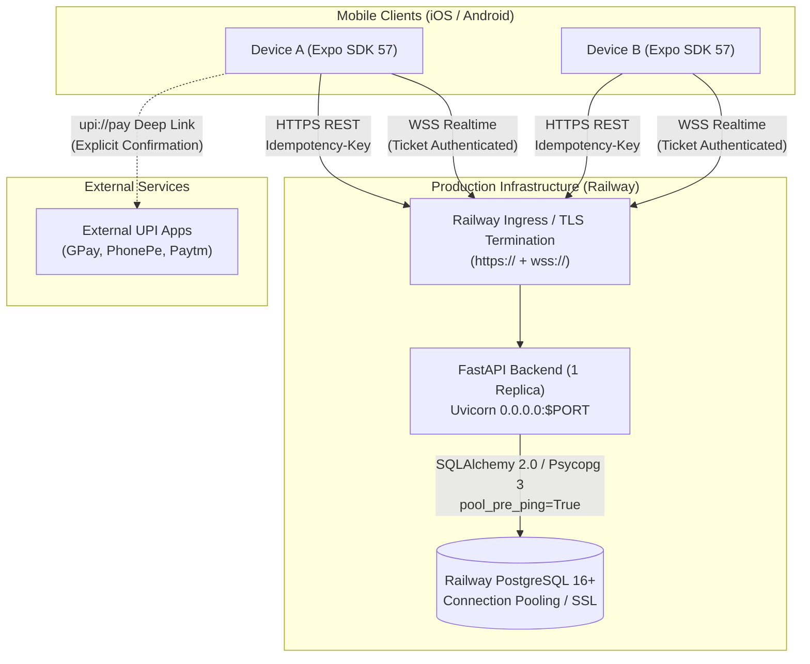

# Friend Ledger — Production Deployment & Release Guide

**Release Version**: v1.0.0 Release Candidate  
**Target Architecture**: Railway (FastAPI + PostgreSQL) & Expo Application Services (iOS TestFlight)  

---

## 1. System Architecture Overview



---

## 2. Railway Deployment Setup

The backend repository is structured inside the `backend/` directory.

### 2.1 Service Configuration Options
You can deploy the backend using either **Nixpacks** (via `backend/railway.json`) or **Docker** (via `backend/Dockerfile`).

#### Step 1: Create Railway Project
1. Log into [Railway](https://railway.com).
2. Create a new Project: **+ New Project** -> **Deploy from GitHub repo**.
3. Select the `friend-ledger` repository.

#### Step 2: Configure Service Root Directory
1. Open the created service -> **Settings** tab.
2. Under **Root Directory**, set:
   ```text
   /backend
   ```
   *(This isolates backend builds from the mobile React Native codebase).*

#### Step 3: Add Railway PostgreSQL Database
1. In your project canvas, click **+ New** -> **Database** -> **Add PostgreSQL**.
2. Railway automatically provisions a managed PostgreSQL instance and sets an internal connection string.

---

## 3. Required Environment Variables

Configure the following variables in the Railway Backend Service **Variables** tab:

| Variable | Recommended / Required Value | Purpose |
| :--- | :--- | :--- |
| `APP_ENV` | `production` | Enables strict production security (prohibits wildcard CORS, enforces strong JWT secret). |
| `DATABASE_URL` | `${{Postgres.DATABASE_URL}}` | Reference to Railway PostgreSQL plugin. Supports both `postgresql://` and `postgres://`. |
| `JWT_SECRET` | *(64+ random hex/alphanumeric characters)* | Cryptographic key for signing user auth access tokens (min 32 chars required). |
| `CORS_ORIGINS` | `https://your-domain.com` *(or omit/empty)* | Comma-separated list of trusted web origins. Wildcards (`*`) are strictly rejected in production. |
| `ACCESS_TOKEN_EXPIRE_MINUTES` | `15` | Access token lifespan (default: 15 mins). |
| `REFRESH_TOKEN_EXPIRE_DAYS` | `30` | Refresh token lifespan (default: 30 days). |

> [!CAUTION]
> Generate a strong JWT secret using a cryptographically secure random generator:
> ```bash
> openssl rand -hex 32
> ```
> Do not use default or placeholder values (`CHANGE_ME`), or the server will fail startup validation.

---

## 4. Single-Replica Realtime Requirement (v1 Invariant)

> [!IMPORTANT]
> **Friend Ledger v1 must run on EXACTLY ONE (1) backend application replica.**
> 
> **Technical Reason**:
> The WebSocket ticket store (`create_realtime_ticket` / `consume_realtime_ticket`) and the active WebSocket client manager (`ConnectionManager`) operate **in-memory** on the running Python process.
> 
> If multiple application replicas are deployed without a shared pub/sub and state store:
> 1. A client might generate an auth ticket on Replica A, but the WebSocket handshake connects to Replica B, resulting in ticket validation failure (`1008 Policy Violation`).
> 2. Financial mutations committed on Replica A will only broadcast invalidation signals to WebSockets connected to Replica A; clients on Replica B will not receive realtime invalidations.
> 
> **Scaling to v2**:
> Horizontal scaling beyond one replica requires moving realtime tickets and event pub/sub to shared infrastructure (e.g. Redis / Redis PubSub). This is catalogued under `DEFER_TO_V2`.

---

## 5. Production Database Migrations

Database schema migrations must be applied **before** application traffic begins.

### Pre-Deploy Command (Automated in `railway.json`)
The `backend/railway.json` configuration defines:
```json
{
  "$schema": "https://railway.com/railway.schema.json",
  "deploy": {
    "numReplicas": 1,
    "preDeployCommand": "uv run alembic upgrade head",
    "startCommand": "uv run uvicorn app.main:app --host 0.0.0.0 --port ${PORT:-8000}",
    "healthcheckPath": "/health/ready",
    "healthcheckTimeout": 100,
    "restartPolicyType": "ON_FAILURE"
  }
}
```

- Railway executes `preDeployCommand` in an isolated ephemeral container with access to all production environment variables.
- If Alembic migration fails, Railway **aborts the deployment** immediately, keeping the previous stable deployment online.

### Manual Verification Command
To manually inspect migration status via Railway CLI or a deployment shell:
```bash
uv run alembic current
uv run alembic heads
```
Ensure the current head matches `cd6ff882a510 (head)`.

---

## 6. Health Checks & Railway Ingress

Friend Ledger exposes two zero-leak health endpoints:

1. **Liveness**: `GET /health/live`
   - Returns: `200 OK` `{"status": "ok", "service": "friend-ledger-api"}`
   - Indicates the Python process and ASGI event loop are responsive.
2. **Readiness**: `GET /health/ready`
   - Performs an active database query (`SELECT 1`).
   - If database is reachable: returns `200 OK` `{"status": "ok", "service": "friend-ledger-api", "database": "reachable"}`.
   - If database is down: returns `503 Service Unavailable` `{"status": "unhealthy", "service": "friend-ledger-api", "database": "unreachable"}`.
   - **No connection strings, credentials, or internal stack traces are ever exposed**.

**Railway Healthcheck Configuration**:
Set the healthcheck path in Railway to `/health/ready`. Railway will only route live traffic to the instance once the readiness check returns 200.

---

## 7. Mobile Production Configuration & EAS Setup

### 7.1 Production API Base URL
The mobile app communicates with the backend via HTTPS and WSS derived from `EXPO_PUBLIC_API_BASE_URL`.

- In `mobile/eas.json`, the `preview` and `production` profiles specify:
  ```json
  "env": {
    "EXPO_PUBLIC_API_BASE_URL": "https://<your-railway-api-domain>"
  }
  ```
- The app automatically derives:
  - REST: `https://<your-railway-api-domain>/api/v1/...`
  - WebSockets: `wss://<your-railway-api-domain>/api/v1/realtime/ws?ticket=...`

### 7.2 EAS Build Profiles (`mobile/eas.json`)
```json
{
  "$schema": "https://json.schemastore.org/eas.json",
  "cli": {
    "version": ">= 15.0.0",
    "appVersionSource": "remote"
  },
  "build": {
    "development": {
      "developmentClient": true,
      "distribution": "internal",
      "env": {
        "EXPO_PUBLIC_API_BASE_URL": "http://127.0.0.1:8000"
      }
    },
    "preview": {
      "distribution": "internal",
      "env": {
        "EXPO_PUBLIC_API_BASE_URL": "https://<your-railway-api-domain>"
      },
      "ios": { "simulator": false }
    },
    "production": {
      "autoIncrement": true,
      "env": {
        "EXPO_PUBLIC_API_BASE_URL": "https://<your-railway-api-domain>"
      },
      "ios": { "simulator": false }
    }
  }
}
```

---

## 8. TestFlight Distribution Process

### Prerequisites
1. Apple Developer Account (Individual or Organization enrollment).
2. App registered in App Store Connect with bundle identifier matching `app.json` (`com.friendledger.app`).
3. EAS CLI installed (`npm install -g eas-cli`) and logged in (`eas login`).

### Step-by-Step Build & Submit
1. Navigate to the mobile directory:
   ```bash
   cd mobile
   ```
2. Build the production release for iOS:
   ```bash
   eas build --platform ios --profile production
   ```
   - EAS will prompt you to log into your Apple Developer account and automatically manage distribution certificates and provisioning profiles.
   - `"autoIncrement": true` ensures each build receives an incremented `buildNumber`.
3. Submit the build to App Store Connect / TestFlight:
   ```bash
   eas submit --platform ios --profile production
   ```
4. Once processed on App Store Connect (usually 10–20 minutes):
   - Open [App Store Connect](https://appstoreconnect.apple.com) -> **Apps** -> **Friend Ledger** -> **TestFlight**.
   - Add Internal Testers (immediate access) or External Testers (requires brief Apple Beta Review).
   - Use copy from `docs/07_APP_STORE_METADATA.md` for "What to Test" notes.

---

## 9. Rollback & Disaster Recovery Procedures

### 9.1 Backend Application Rollback
If a newly deployed backend version exhibits runtime errors:
1. In the Railway Dashboard -> Backend Service -> **Deployments**.
2. Locate the previously healthy deployment and click **Redeploy**.
3. Railway instantly switches ingress traffic back to the previous deployment container.

### 9.2 Database Rollback Policy
> [!CAUTION]
> **DO NOT automatically run `alembic downgrade` in production.**
> 
> Downgrades can permanently drop columns, tables, or audit logs. Follow these safety rules:
> 1. If the previous application code is backward-compatible with the new schema (e.g. newly added columns like `upi_id` are nullable), **leave the database at the current migration head** and simply roll back the application container.
> 2. If a database downgrade is strictly unavoidable:
>    - Create a complete manual PostgreSQL database backup in Railway (**Backups** -> **Take Backup**).
>    - Test the downgrade script locally against a copy of the database.
>    - Execute the specific revision downgrade manually via Railway CLI or shell:
>      ```bash
>      uv run alembic downgrade <target_revision>
>      ```

---

## 10. Post-Deployment Production Smoke Test Checklist

Execute these steps against the live deployment using two devices (Device A and Device B):

- [ ] **1. Liveness**: Verify `GET /health/live` returns HTTP 200.
- [ ] **2. Readiness**: Verify `GET /health/ready` returns HTTP 200 and `"database": "reachable"`.
- [ ] **3. User A Registration**: Register User A with unique username and display name. Verify JWT tokens stored securely.
- [ ] **4. User B Registration**: Register User B on Device B.
- [ ] **5. Outing Creation**: User A creates an outing (e.g. "Launch Celebration").
- [ ] **6. QR Join**: User B scans User A's QR code (or enters 6-char code) to join.
- [ ] **7. Realtime Participant Update**: Verify User A's screen shows User B in participants list without manual pull-to-refresh.
- [ ] **8. Add Payment**: Verify the prominent `+ Add Payment` button is now visible (since active participants $\ge 2$). User A records a payment of ₹600 split equally.
- [ ] **9. Realtime Payment Update**: Verify User B's screen updates immediately with the new payment card.
- [ ] **10. Balance Correctness**: Verify User B sees "You owe User A ₹300", and User A sees "User B owes you ₹300".
- [ ] **11. UPI QR Presentation**: User A sets UPI ID in Profile, goes to Balances -> User B -> "Collect via UPI", and displays QR.
- [ ] **12. UPI Settlement Recording**: User B taps "Record Settlement" -> "Pay via UPI App". Upon returning from external app, User B taps "Yes, Record Settlement" on the confirmation prompt.
- [ ] **13. Realtime Settlement Invalidation**: Verify both devices immediately show balances reduced to ₹0 (Settled Up).
- [ ] **14. Auth Persistence**: Close and relaunch the app; verify session restores without requiring re-login.
- [ ] **15. App State Recovery**: Background the app on Device B. Record a new payment from Device A. Bring Device B to foreground; verify state refreshes automatically.
- [ ] **16. WebSocket Reconnect**: Toggle Airplane Mode on Device B for 10 seconds and turn off; verify WebSocket reconnects and catches up state.
- [ ] **17. Void Transaction**: User A voids the payment; verify debt balance reverts to settled.
- [ ] **18. Outing Finish**: User B leaves outing; User A marks outing finished. Verify outing moves to "Past Outings".

---

## 11. Production Troubleshooting Guide

| Issue | Likely Cause | Resolution |
| :--- | :--- | :--- |
| `DATABASE_URL cannot be empty` or `must be PostgreSQL connection URL` | Railway environment variable missing or bad scheme prefix. | Ensure `DATABASE_URL` is set to `${{Postgres.DATABASE_URL}}`. Note that the backend automatically normalizes both `postgres://` and `postgresql://` to `postgresql+psycopg://`. |
| `JWT_SECRET cannot be a trivial or placeholder value` | Default `CHANGE_ME` secret left in production environment. | Set `JWT_SECRET` in Railway Variables to a 64+ char random hex string generated via `openssl rand -hex 32`. |
| `Wildcard CORS origins ('*') are strictly prohibited in production` | `CORS_ORIGINS` variable set to `*`. | Set explicit origins or leave blank in Railway. Native iOS mobile traffic is not subject to browser CORS. |
| WebSocket handshake fails with `1008 Policy Violation` | Ticket missing, expired (>60s), or already consumed. | Client automatically requests a fresh ticket via `POST /api/v1/realtime/ticket` on reconnect. Ensure backend is running exactly 1 replica. |
| Camera scan fails on iOS | Missing permission string or permission rejected in iOS Settings. | Ensure `NSCameraUsageDescription` is present in `app.json`. User can re-enable in iOS Settings -> Friend Ledger -> Camera. |
| UPI App does not open | No UPI app installed (e.g. iOS Simulator). | The app displays an inline fallback allowing the user to copy the payee's UPI ID and confirm manual settlement. |
